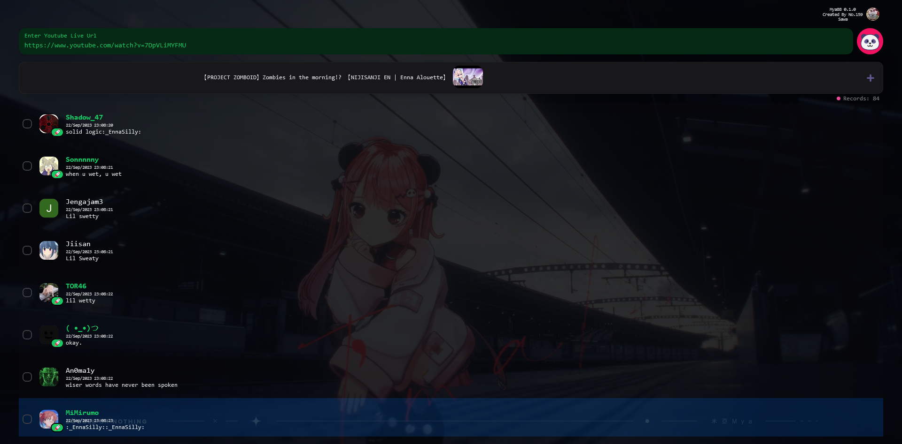

# Sayonara-mya



## Problem Statement

[HKVtuber MYA](https://www.youtube.com/@mya.) will say 'bye bye' to the audience and read audience name one by one before the live stream end. Unfortunately chatroom may contains some 'bye bye' message that mixed with different unrelated message, which will cause MYA difficult to see and differentiate 'bye bye' messages from distinct users, and Can you help MYA write a program to solve this issue?

## Usage

This webapp is a youtube live chat viewer powered by NextJS.

1. When you ready to say good-bye, open this webapp.
2. Input the passphrase to authenticate.
3. Input the live stream URL, for example `https://www.youtube.com/watch?v=92VgDXjI4Xg`.
4. List of youtube chat messages should show and update periodically.
5. Mouse click on the list item, the user message will be marked as "Read" (Green color). The future incoming message of that user will also marked as "Read" automatically. So user just need to click the list item -> focus and read those un-ticked list item.

### Notices

🗝️ Secret Code Protection: only designated individuals can use this application.  
✅ Filtering on chat message by superchat / member gift types.  
👁️ Distinguish different author role and types of message.  
✨ This webapp can **ONLY** retrieve the chat message published from **current moment**.  
✨ This webapp consume Youtube Data API v3, which has daily quota limit (Don't worry, it's free). If you try to open this webapp to record the message of live stream from the beginning, it may exhaust API quota, I would personally suggest not to doing this.  
Here is the testing statistic:

- 3 hours 14 minutes: 97.43% of 10000 quota, 1960 request, [live stream link](https://www.youtube.com/watch?v=X4JywMi7_Nw)

## Development

```bash
npm run dev
# or
yarn dev
# or
pnpm dev
```

Open [http://localhost:3000](http://localhost:3000) with your browser to see the result.

## Deploy on Vercel

The easiest way to deploy your Next.js app is to use the [Vercel Platform](https://vercel.com/new?utm_medium=default-template&filter=next.js&utm_source=create-next-app&utm_campaign=create-next-app-readme) from the creators of Next.js.

Check out our [Next.js deployment documentation](https://nextjs.org/docs/deployment) for more details.
